# GitHub Repository Setup Guide

A comprehensive guide and Claude Code skill for setting up GitHub repositories with production-grade automation.

[](LICENSE)
[](https://github.com/domelic/github-repository-setup/actions/workflows/release-please.yml)
[](https://github.com/domelic/github-repository-setup/releases)
[](https://github.com/domelic/github-repository-setup/graphs/contributors)

---

## Overview

This guide covers everything needed to set up a professional GitHub repository:

| Category | What's Included |
|----------|-----------------|
| **Documentation** | README, LICENSE, CONTRIBUTING, CHANGELOG, CODE_OF_CONDUCT, RELEASING |
| **Branch Protection** | PR requirements, CODEOWNERS, admin enforcement |
| **Issue/PR Management** | Templates, labels, PR template, stale bot, welcome bot |
| **Quality Gates** | Commitlint, spell check, link checker, markdown lint, pre-commit hooks |
| **Release Automation** | Release Please, auto-CHANGELOG, semantic versioning |
| **CI/CD** | Build workflows, E2E testing, cross-platform CI, Dependabot |
| **Security** | CodeQL, Trivy, OpenSSF Scorecard, SBOM generation |
| **Publishing** | npm, PyPI, Docker, crates.io publishing workflows |
| **Deployment** | GitHub Pages, Vercel, Netlify, AWS, Kubernetes |
| **Discovery** | Topics, social preview, FUNDING.yml, CITATION.cff |
| **MCP Integrations** | [Serena](docs/SERENA.md), [Zotero](docs/ZOTERO_MCP.md), [Obsidian](docs/OBSIDIAN_MCP.md) |

### CI/CD Pipeline Flow

```mermaid
flowchart TB
    subgraph Trigger["🚀 Trigger"]
        push["Push to main"]
        pr["Pull Request"]
    end

    subgraph Quality["✅ Quality Gates"]
        commitlint["Commitlint"]
        spell["Spell Check"]
        links["Link Checker"]
        mdlint["Markdown Lint"]
    end

    subgraph CI["🔨 CI Workflows"]
        build["Build"]
        test["Test"]
        lint["Lint"]
        security["Security Scan"]
    end

    subgraph Release["📦 Release"]
        rp["Release Please"]
        tag["Create Tag"]
        changelog["Update CHANGELOG"]
    end

    subgraph Publish["📤 Publish"]
        npm["npm"]
        pypi["PyPI"]
        docker["Docker"]
        crates["crates.io"]
    end

    subgraph Deploy["🌐 Deploy"]
        pages["GitHub Pages"]
        vercel["Vercel"]
        aws["AWS"]
        k8s["Kubernetes"]
    end

    push --> Quality
    pr --> Quality
    Quality --> CI
    CI --> Release
    Release --> Publish
    Release --> Deploy
```



---

## Quick Start

### Using the Claude Code Skill

Install the `/github-setup` skill in your repository:

```bash
mkdir -p .claude/commands
curl -o .claude/commands/github-setup.md \
  https://raw.githubusercontent.com/domelic/github-repository-setup/main/templates/commands/github-setup.md
```

Then use it:

```bash
/github-setup                    # Full setup wizard (auto-detects project type)
/github-setup checklist          # Audit what's missing
/github-setup docs               # Documentation files
/github-setup protection         # Branch protection + CODEOWNERS
/github-setup quality            # Linting, spell check, link checker
/github-setup releases           # Release Please automation
```

**Language presets:** `nodejs`, `python`, `go`, `rust`, `java`, `ruby`, `php`, `dotnet`

**Category presets:** `ci`, `security`, `deploy`, `testing`, `precommit`, `notifications`

### Manual Setup

1. Copy templates from [`templates/`](templates/) directory
2. Follow the [Complete Setup Checklist](#complete-setup-checklist)
3. Customize for your project

---

## Table of Contents

1. [Documentation Files](#1-documentation-files)
2. [Repository Settings](#2-repository-settings)
3. [Quality Gates](#3-quality-gates)
4. [Release Automation](#4-release-automation)
5. [CI Workflows](#5-ci-workflows)
6. [Security Workflows](#6-security-workflows)
7. [Publishing & Deployment](#7-publishing--deployment)
8. [Configuration Files](#8-configuration-files)
9. [Discovery & Sponsorship](#9-discovery--sponsorship)
10. [MCP Integrations](#10-mcp-integrations)
11. [Specialty: Book Publishing](#11-specialty-book-publishing)
12. [Complete Setup Checklist](#complete-setup-checklist)
13. [Troubleshooting](#troubleshooting)
14. [Resources](#resources)

---

## 1. Documentation Files

### Required Files

| File | Purpose | Template |
|------|---------|----------|
| `README.md` | Project overview, badges, usage | — |
| `LICENSE` | Legal terms | [choosealicense.com](https://choosealicense.com/) |
| `CONTRIBUTING.md` | How to contribute | [Template](templates/CONTRIBUTING.md) |
| `CHANGELOG.md` | Version history | [Keep a Changelog](https://keepachangelog.com/) |

### Recommended Files

| File | Purpose | Template |
|------|---------|----------|
| `CODE_OF_CONDUCT.md` | Community guidelines | [Contributor Covenant](https://www.contributor-covenant.org/) |
| `RELEASING.md` | Release process docs | [Template](templates/RELEASING.md) |
| `CITATION.cff` | Machine-readable citation | [Template](templates/CITATION.cff) |
| `CLAUDE.md` | Claude Code instructions | [Template](templates/CLAUDE.md) |
| `SECURITY.md` | Vulnerability reporting | For software projects |

### CITATION.cff (For Academic/Citable Projects)

```yaml
cff-version: 1.2.0
title: "Your Project Title"
message: "If you use this software, please cite it as below."
authors:
  - family-names: LastName
    given-names: FirstName
    orcid: "https://orcid.org/0000-0000-0000-0000"
version: "1.0.0"
doi: "10.5281/zenodo.XXXXXXX"
date-released: "2024-01-01"
url: "https://github.com/owner/repo"
```

GitHub displays a "Cite this repository" button when this file exists.

---

## 2. Repository Settings

### Branch Protection

#### Configuration via CLI

```bash
gh api repos/OWNER/REPO/branches/main/protection -X PUT --input - <<'EOF'
{
  "required_status_checks": {
    "strict": true,
    "contexts": ["build", "test"]
  },
  "enforce_admins": true,
  "required_pull_request_reviews": {
    "required_approving_review_count": 0
  },
  "restrictions": null,
  "allow_force_pushes": false,
  "allow_deletions": false
}
EOF
```

#### Auto-Delete Merged Branches

```bash
gh api repos/OWNER/REPO -X PATCH -f delete_branch_on_merge=true
```

#### Branch Naming Convention

Branch names should match conventional commit types:

| Type | Branch Prefix | Example |
|------|---------------|---------|
| `feat` | `feat/` | `feat/user-authentication` |
| `fix` | `fix/` | `fix/memory-leak` |
| `docs` | `docs/` | `docs/api-guide` |
| `chore` | `chore/` | `chore/update-deps` |
| `ci` | `ci/` | `ci/add-workflow` |
| `refactor` | `refactor/` | `refactor/parser-logic` |

**Rules:** lowercase, hyphens between words, concise but descriptive

#### Branching Strategy

**When to use feature branches vs. small PRs:**

| Work Type | Approach | Why |
|-----------|----------|-----|
| **Exploratory/investigative** | Feature branch | Accumulate changes, merge once when stable |
| **Interconnected fixes** | Feature branch | Related changes should ship together |
| **Independent, unrelated fixes** | Small PRs | Each has standalone value |
| **Production hotfixes** | Small PRs | Need immediate deployment |
| **New features** | Feature branch | Develop fully before merging |
| **CI/infrastructure changes** | Feature branch | Test everything works before merging |

**Anti-pattern to avoid:**

```text
# BAD: Many small PRs for interconnected exploratory work
fix #1 → PR → merge → v1.0.1
fix #2 → PR → merge → v1.0.2  (discovered while fixing #1)
fix #3 → PR → merge → v1.0.3  (discovered while fixing #2)
fix #4 → PR → merge → v1.0.4  (related to #1-3)

# GOOD: Feature branch for exploratory work
fix/infrastructure-improvements branch
  ├── fix #1 (commit)
  ├── fix #2 (commit)
  ├── fix #3 (commit)
  └── fix #4 (commit)
        ↓
    single PR → merge → v1.0.1
```

**Key insight:** If you're discovering related issues as you work, you're doing exploratory work—use a feature branch. If fixes are truly independent and each could ship alone, use small PRs.

#### Settings by Team Size

| Setting | Solo | Small Team | Large Team |
|---------|------|------------|------------|
| PRs required | Yes | Yes | Yes |
| Approvals | 0 | 1 | 2+ |
| CODEOWNERS | Optional | Yes | Yes |
| Status checks | Optional | Yes | Yes |
| Enforce admins | Yes | Yes | Yes |

#### CODEOWNERS

Location: `.github/CODEOWNERS`

```text
# Default owner
* @username

# By path
/docs/ @docs-team
/src/api/ @backend-team

# By file type
*.ts @typescript-team
```

### Issue & PR Management

#### Issue Templates

Location: `.github/ISSUE_TEMPLATE/`

See [`templates/ISSUE_TEMPLATE/`](templates/ISSUE_TEMPLATE/) for complete examples:

- `bug_report.md` — Bug reports
- `feature_request.md` — Feature requests
- `config.yml` — Template chooser config

#### PR Template

Location: `.github/PULL_REQUEST_TEMPLATE.md`

```markdown
## Summary
<!-- Brief description -->

## Type of Change
- [ ] Bug fix
- [ ] New feature
- [ ] Documentation
- [ ] Refactoring

## Checklist
- [ ] Tests pass
- [ ] Documentation updated
- [ ] Commits follow conventional format
```

#### Labels

```bash
# Essential labels
gh label create "bug" -c "d73a4a" -d "Something isn't working"
gh label create "enhancement" -c "a2eeef" -d "New feature or request"
gh label create "documentation" -c "0075ca" -d "Documentation improvements"
gh label create "good first issue" -c "7057ff" -d "Good for newcomers"
gh label create "help wanted" -c "008672" -d "Extra attention needed"

# Priority labels
gh label create "priority: critical" -c "b60205" -d "Must be fixed immediately"
gh label create "priority: high" -c "d93f0b" -d "High priority"
gh label create "priority: medium" -c "fbca04" -d "Medium priority"
gh label create "priority: low" -c "c5def5" -d "Low priority"

# Status labels
gh label create "in-progress" -c "0e8a16" -d "Work in progress"
gh label create "blocked" -c "b60205" -d "Blocked by dependency"
gh label create "stale" -c "ededed" -d "Inactive issue/PR"
gh label create "pinned" -c "006b75" -d "Exempt from stale bot"

# Automation labels
gh label create "dependencies" -c "0366d6" -d "Dependency updates"
gh label create "github-actions" -c "000000" -d "CI/CD changes"
```

#### Enable Discussions

```bash
gh api repos/OWNER/REPO -X PATCH -f has_discussions=true
```

#### Stale Bot

See [`templates/workflows/stale.yml`](templates/workflows/stale.yml)

Automatically marks and closes inactive issues/PRs:

- Marks stale after 45 days
- Closes after 14 more days (60 total)
- Exempt: `pinned`, `security`, `in-progress` labels

#### Welcome Bot

See [`templates/workflows/welcome.yml`](templates/workflows/welcome.yml)

Greets first-time contributors with helpful information.

---

## 3. Quality Gates

### Commitlint (Conventional Commits)

Enforces commit message format: `type: description`

**Workflow:** [`templates/workflows/commitlint.yml`](templates/workflows/commitlint.yml)
**Config:** [`templates/commitlint.config.js`](templates/commitlint.config.js)

```bash
# Valid commits
feat: add user authentication
fix: resolve memory leak in parser
docs: update API documentation

# Invalid commits
added feature        # No type
feat add feature     # Missing colon
FEAT: add feature    # Wrong case
```

### Spell Check

Uses cspell with custom dictionary support.

**Workflow:** [`templates/workflows/spell-check.yml`](templates/workflows/spell-check.yml)
**Config:** [`templates/.cspell.json`](templates/.cspell.json)

### Link Checker

Validates all links in markdown files.

**Workflow:** [`templates/workflows/link-checker.yml`](templates/workflows/link-checker.yml)

- Runs on push/PR to markdown files
- Weekly scheduled scan
- Auto-creates issue if broken links found

### Markdown Lint

Enforces consistent markdown formatting.

**Workflow:** [`templates/workflows/markdown-lint.yml`](templates/workflows/markdown-lint.yml)
**Config:** [`templates/.markdownlint.json`](templates/.markdownlint.json)
**Guide:** [docs/MARKDOWN_LINT.md](docs/MARKDOWN_LINT.md) — Common rules and fixes

### Pre-commit Hooks

Pre-commit hooks automate code quality checks before each commit.

**File:** [`templates/.pre-commit-config.yaml`](templates/.pre-commit-config.yaml)

#### Setup

```bash
# Install pre-commit
pip install pre-commit

# Install hooks in your repository
pre-commit install
pre-commit install --hook-type commit-msg

# Run on all files (first time or manually)
pre-commit run --all-files

# Update hooks to latest versions
pre-commit autoupdate
```

#### Included Hooks

| Hook | Languages | Purpose |
|------|-----------|---------|
| `pre-commit-hooks` | All | Trailing whitespace, file endings, YAML/JSON checks |
| `ruff` | Python | Fast linting and formatting |
| `prettier` | JS/TS/JSON/YAML/MD | Code formatting |
| `conventional-pre-commit` | All | Commit message validation |
| `detect-secrets` | All | Prevent committing secrets |
| `shellcheck` | Bash | Shell script linting |
| `markdownlint` | Markdown | Markdown formatting |

#### Language-Specific Hooks

The template includes commented sections for additional languages:

- **Go** — golangci-lint
- **Rust** — cargo fmt, clippy

Uncomment the relevant sections in `.pre-commit-config.yaml` for your project.

#### CI Integration

The configuration includes CI settings for automated hook updates:

```yaml
ci:
  autofix_commit_msg: "style: auto-fix from pre-commit hooks"
  autoupdate_schedule: monthly
```

---

## 4. Release Automation

### Release Please (Recommended)

Fully automated releases from conventional commits.

**Workflow:** [`templates/workflows/release-please.yml`](templates/workflows/release-please.yml)
**Config:** [`templates/release-please-config.json`](templates/release-please-config.json)

**How it works:**

```text
feat: add feature → Push → Release PR created → Merge → v1.1.0 released
```

| Commit Type | Version Bump |
|-------------|--------------|
| `feat:` | Minor (1.0.0 → 1.1.0) |
| `fix:` | Patch (1.0.0 → 1.0.1) |
| `feat!:` or `BREAKING CHANGE:` | Major (1.0.0 → 2.0.0) |
| `chore:`, `ci:` | No release |

### Manual Release Workflow

If you prefer manual control:

**Workflow:** [`templates/workflows/release-manual.yml`](templates/workflows/release-manual.yml)

```bash
git tag v1.0.0
git push origin v1.0.0
# Release created automatically
```

---

## 5. CI Workflows

### Generic CI

#### Dependabot (Auto-update Actions)

**Config:** [`templates/dependabot.yml`](templates/dependabot.yml)

- Updates GitHub Actions weekly
- Groups updates into single PR
- Uses conventional commit format

#### Build/Test Workflow

**Workflow:** [`templates/workflows/ci.yml`](templates/workflows/ci.yml)

#### Artifact Preview on PRs

Upload build artifacts for review before merge.

**Workflow:** [`templates/workflows/artifact-preview.yml`](templates/workflows/artifact-preview.yml)

### Language-Specific CI

Pre-configured CI workflows for major programming languages with version matrix testing.

#### Node.js CI

**Workflow:** [`templates/workflows/ci-nodejs.yml`](templates/workflows/ci-nodejs.yml)

| Feature | Details |
|---------|---------|
| Node versions | 18, 20, 22 |
| Package manager | npm with caching |
| Steps | Install, lint, type-check, test, build |

#### Python CI

**Workflow:** [`templates/workflows/ci-python.yml`](templates/workflows/ci-python.yml)

| Feature | Details |
|---------|---------|
| Python versions | 3.10, 3.11, 3.12 |
| Package manager | pip with caching |
| Linting | ruff (linter + formatter) |
| Type checking | mypy |
| Testing | pytest with coverage |

#### Go CI

**Workflow:** [`templates/workflows/ci-go.yml`](templates/workflows/ci-go.yml)

| Feature | Details |
|---------|---------|
| Go versions | 1.21, 1.22 |
| Linting | golangci-lint |
| Testing | go test with race detection |

#### Rust CI

**Workflow:** [`templates/workflows/ci-rust.yml`](templates/workflows/ci-rust.yml)

| Feature | Details |
|---------|---------|
| Toolchains | stable, nightly (+ optional MSRV) |
| Linting | clippy |
| Formatting | rustfmt |
| Caching | Swatinem/rust-cache |

#### Java CI

**Workflow:** [`templates/workflows/ci-java.yml`](templates/workflows/ci-java.yml)

| Feature | Details |
|---------|---------|
| JDK versions | 17, 21 (Temurin) |
| Build tools | Maven, Gradle support |
| Caching | Maven/Gradle dependencies |

#### Ruby CI

**Workflow:** [`templates/workflows/ci-ruby.yml`](templates/workflows/ci-ruby.yml)

| Feature | Details |
|---------|---------|
| Ruby versions | 3.2, 3.3 |
| Package manager | Bundler with caching |
| Linting | RuboCop |
| Testing | RSpec, Minitest support |

#### PHP CI

**Workflow:** [`templates/workflows/ci-php.yml`](templates/workflows/ci-php.yml)

| Feature | Details |
|---------|---------|
| PHP versions | 8.2, 8.3 |
| Package manager | Composer with caching |
| Linting | PHP-CS-Fixer, PHPStan |
| Testing | PHPUnit |

#### .NET CI

**Workflow:** [`templates/workflows/ci-dotnet.yml`](templates/workflows/ci-dotnet.yml)

| Feature | Details |
|---------|---------|
| .NET versions | 8.0, 9.0 |
| Caching | NuGet packages |
| Format check | dotnet format |

#### Shared Features

All language-specific CI workflows include:

- **Concurrency control** — Cancel in-progress runs for same ref
- **Matrix testing** — Test across multiple language versions
- **Fail-fast disabled** — All matrix jobs complete
- **Caching** — Package manager caches for speed

### E2E Testing

End-to-end testing workflows for comprehensive UI and performance testing.

#### Playwright E2E Testing

**Workflow:** [`templates/workflows/e2e-playwright.yml`](templates/workflows/e2e-playwright.yml)

| Feature | Details |
|---------|---------|
| Browser support | Chromium, Firefox, WebKit |
| Artifact upload | Test reports and screenshots |
| Parallel execution | Sharded test runs for large suites |
| Multi-browser matrix | Optional parallel browser testing |

Features:

- Automatic browser installation with `--with-deps`
- Test report artifacts uploaded on any outcome
- Optional sharding for large test suites (e.g., 4 shards)

#### Cypress E2E Testing

**Workflow:** [`templates/workflows/e2e-cypress.yml`](templates/workflows/e2e-cypress.yml)

| Feature | Details |
|---------|---------|
| Dev server | Automatic start with wait-on |
| Artifacts | Screenshots and videos on failure |
| Parallel | Optional Cypress Cloud integration |
| Component testing | Optional component test support |

Features:

- Automatic dev server startup with configurable wait
- Screenshot and video artifacts on failure
- Optional parallel execution with Cypress Cloud

#### Cross-Platform CI

**Workflow:** [`templates/workflows/ci-cross-os.yml`](templates/workflows/ci-cross-os.yml)

Run CI across multiple operating systems:

| Platform | Runner |
|----------|--------|
| Linux | `ubuntu-latest` |
| macOS | `macos-latest` |
| Windows | `windows-latest` |

Features:

- Fail-fast disabled (all platforms complete)
- Optional language version matrix
- Platform-specific artifact uploads
- Examples for Node.js, Python, Rust, Go

#### Lighthouse Performance Testing

**Workflow:** [`templates/workflows/lighthouse.yml`](templates/workflows/lighthouse.yml)

| Feature | Details |
|---------|---------|
| Audits | Performance, accessibility, SEO, best practices |
| Thresholds | Configurable score requirements |
| Reports | Temporary public storage upload |
| Budgets | Optional performance budget assertions |

Features:

- Lighthouse CI with configurable thresholds
- Performance budgets for CI enforcement
- Supports both local builds and deployed URLs

---

## 6. Security Workflows

Comprehensive security scanning and supply chain protection.

### CodeQL (SAST)

**Workflow:** [`templates/workflows/codeql.yml`](templates/workflows/codeql.yml)

Static Application Security Testing for:

- JavaScript/TypeScript
- Python
- Java
- C/C++
- C#
- Go
- Ruby
- Swift/Kotlin

Features:

- Weekly scheduled scans + PR checks
- Results in GitHub Security tab
- Custom queries support

### Trivy Vulnerability Scanner

**Workflow:** [`templates/workflows/trivy.yml`](templates/workflows/trivy.yml)

| Scan Type | Purpose |
|-----------|---------|
| Filesystem | Dependency vulnerabilities |
| Container | Docker image scanning |
| Config | IaC misconfigurations |

Features:

- SARIF output for GitHub integration
- Severity filtering (CRITICAL, HIGH)
- Container and IaC scanning options

### OpenSSF Scorecard

**Workflow:** [`templates/workflows/scorecard.yml`](templates/workflows/scorecard.yml)

Supply chain security assessment:

- Branch protection checks
- Dependency update monitoring
- Token permissions analysis
- Code review practices
- Vulnerability disclosure process

Enables the OpenSSF Scorecard badge for your repository.

### SBOM Generation

**Workflow:** [`templates/workflows/sbom.yml`](templates/workflows/sbom.yml)

Software Bill of Materials generation:

- SPDX format
- CycloneDX format
- Automatic attachment to releases
- Optional Grype vulnerability scanning

---

## 7. Publishing & Deployment

### Package Publishing

Automated package publishing on GitHub release.

#### npm Publishing

**Workflow:** [`templates/workflows/publish-npm.yml`](templates/workflows/publish-npm.yml)

- Publishes with provenance (supply chain security)
- Verifies version matches tag
- Supports GitHub Packages (optional)

**Required secret:** `NPM_TOKEN`

#### PyPI Publishing

**Workflow:** [`templates/workflows/publish-pypi.yml`](templates/workflows/publish-pypi.yml)

- Uses OIDC trusted publishing (no secrets needed)
- Builds with `python -m build`
- Supports TestPyPI (optional)

**Setup:** Configure trusted publishing at [pypi.org/manage/account/publishing](https://pypi.org/manage/account/publishing)

#### Docker Publishing

**Workflow:** [`templates/workflows/publish-docker.yml`](templates/workflows/publish-docker.yml)

- Publishes to GitHub Container Registry (GHCR)
- Optional Docker Hub publishing
- Multi-platform builds (amd64, arm64)
- Automatic tagging (semver, sha)
- Build provenance and SBOM

#### crates.io Publishing

**Workflow:** [`templates/workflows/publish-crates.yml`](templates/workflows/publish-crates.yml)

- Verifies Cargo.toml version matches tag
- Runs `cargo package` check first
- Supports workspaces with cargo-workspaces

**Required secret:** `CRATES_IO_TOKEN`

### Deployment

Automated deployment workflows for static sites, serverless, and containerized applications.

#### Static Site Deployments

##### GitHub Pages

**Workflow:** [`templates/workflows/deploy-github-pages.yml`](templates/workflows/deploy-github-pages.yml)

- Supports Node.js, Python (MkDocs), Rust (mdBook)
- Uses GitHub Pages official actions
- Configurable build output directory

##### Vercel

**Workflow:** [`templates/workflows/deploy-vercel.yml`](templates/workflows/deploy-vercel.yml)

- Preview deployments on PRs
- Production deployments on merge to main
- PR comments with preview URLs

**Required secrets:** `VERCEL_TOKEN`, `VERCEL_ORG_ID`, `VERCEL_PROJECT_ID`

##### Netlify

**Workflow:** [`templates/workflows/deploy-netlify.yml`](templates/workflows/deploy-netlify.yml)

- Preview deployments on PRs
- Production deployments on merge to main
- PR comments with preview URLs

**Required secrets:** `NETLIFY_AUTH_TOKEN`, `NETLIFY_SITE_ID`

#### AWS Deployments

##### AWS S3 + CloudFront

**Workflow:** [`templates/workflows/deploy-aws-s3.yml`](templates/workflows/deploy-aws-s3.yml)

| Feature | Details |
|---------|---------|
| Authentication | OIDC (no long-lived secrets) |
| Caching | Cache-Control headers for immutable assets |
| Invalidation | Automatic CloudFront cache invalidation |

**Required secrets:** `AWS_ROLE_ARN`, `S3_BUCKET`, `CLOUDFRONT_DISTRIBUTION_ID`

##### AWS Lambda

**Workflow:** [`templates/workflows/deploy-aws-lambda.yml`](templates/workflows/deploy-aws-lambda.yml)

| Feature | Details |
|---------|---------|
| Deployment | Function code with versioning |
| Blue-green | Optional alias updates |
| Alternatives | SAM, Serverless Framework examples |

**Required secrets:** `AWS_ROLE_ARN`, `LAMBDA_FUNCTION_NAME`

#### Container & Kubernetes Deployments

##### Kubernetes

**Workflow:** [`templates/workflows/deploy-kubernetes.yml`](templates/workflows/deploy-kubernetes.yml)

| Feature | Details |
|---------|---------|
| Registry | GitHub Container Registry (GHCR) |
| Manifests | Kustomize-based management |
| Verification | Rollout status checks |
| Alternatives | Helm, EKS, GKE examples |

**Required secrets:** `KUBE_CONFIG` (base64-encoded kubeconfig)

#### Platform-as-a-Service Deployments

##### Railway

**Workflow:** [`templates/workflows/deploy-railway.yml`](templates/workflows/deploy-railway.yml)

**Required secrets:** `RAILWAY_TOKEN`, `RAILWAY_SERVICE_ID`

##### Fly.io

**Workflow:** [`templates/workflows/deploy-fly.yml`](templates/workflows/deploy-fly.yml)

**Required secrets:** `FLY_API_TOKEN`

**Required file:** `fly.toml` in repository root

##### Render

**Workflow:** [`templates/workflows/deploy-render.yml`](templates/workflows/deploy-render.yml)

**Required secrets:** `RENDER_DEPLOY_HOOK_URL`

#### Platform Comparison

| Platform | Best For | Auth Method | Free Tier |
|----------|----------|-------------|-----------|
| GitHub Pages | Static sites | Built-in | Yes |
| Vercel | Next.js, React | Token | Yes |
| Netlify | JAMstack | Token | Yes |
| AWS S3 | Enterprise static | OIDC | Pay-as-you-go |
| AWS Lambda | Serverless functions | OIDC | Free tier |
| Kubernetes | Complex applications | kubeconfig | Self-hosted |
| Railway | Full-stack apps | Token | Limited |
| Fly.io | Containers, global edge | Token | Yes |
| Render | Full-stack apps | Webhook | Yes |

### Notifications

Send notifications to Slack or Discord for releases and CI failures.

#### Slack Notifications

**Workflow:** [`templates/workflows/notify-slack.yml`](templates/workflows/notify-slack.yml)

| Event | Notification |
|-------|-------------|
| Release published | New release announcement with changelog |
| CI failure | Alert with branch, commit, and workflow link |

**Setup:**

1. Create a Slack App at https://api.slack.com/apps
2. Enable "Incoming Webhooks" in the app settings
3. Add a new webhook to your workspace
4. Copy the webhook URL to repository secrets as `SLACK_WEBHOOK_URL`

#### Discord Notifications

**Workflow:** [`templates/workflows/notify-discord.yml`](templates/workflows/notify-discord.yml)

| Event | Notification |
|-------|-------------|
| Release published | New release announcement with changelog |
| CI failure | Alert with branch, commit, and workflow link |

**Setup:**

1. In Discord, go to Server Settings > Integrations > Webhooks
2. Create a new webhook for your notifications channel
3. Copy the webhook URL to repository secrets as `DISCORD_WEBHOOK`

#### Required Secrets

| Secret | Platform | Purpose |
|--------|----------|---------|
| `SLACK_WEBHOOK_URL` | Slack | Incoming webhook URL |
| `DISCORD_WEBHOOK` | Discord | Webhook URL |

### API Documentation

Automated API documentation generation and deployment to GitHub Pages.

**Workflow:** [`templates/workflows/docs-api.yml`](templates/workflows/docs-api.yml)

#### Supported Documentation Generators

| Generator | Language | Source Format |
|-----------|----------|---------------|
| Redocly | OpenAPI/Swagger | YAML/JSON |
| TypeDoc | TypeScript/JavaScript | Source code |
| Sphinx | Python | RST/autodoc |
| Rustdoc | Rust | Source code |
| Javadoc | Java | Source code |

#### OpenAPI/Swagger (Default)

The workflow automatically finds and builds documentation from:

- `openapi.yaml` / `openapi.json`
- `swagger.yaml` / `swagger.json`
- `docs/openapi.yaml`

Features:

- Lint validation with Redocly
- Beautiful HTML output with Redoc
- Automatic deployment to GitHub Pages

#### Setup

1. Enable GitHub Pages in repository settings
2. Set source to "GitHub Actions"
3. Place your OpenAPI spec in the root or `docs/` directory
4. Push to main branch to trigger build

#### Other Generators

Uncomment the relevant section in the workflow for:

- **TypeDoc** — Requires `npm ci` and TypeDoc configuration
- **Sphinx** — Requires Python and `docs/source/` structure
- **Rustdoc** — Requires Cargo project
- **Javadoc** — Requires Maven or Gradle project

#### Example OpenAPI Spec Location

```text
my-project/
├── openapi.yaml      # ← Workflow finds this
├── src/
└── .github/
    └── workflows/
        └── docs-api.yml
```

---

## 8. Configuration Files

### Modern Tooling Configs

Pre-configured templates for modern JavaScript/TypeScript tooling.

#### Biome (ESLint + Prettier Alternative)

**File:** [`templates/biome.json`](templates/biome.json)

| Feature | Details |
|---------|---------|
| Speed | ~100x faster than ESLint + Prettier |
| Config | Single file for linting + formatting |
| Languages | JavaScript, TypeScript, JSON |

#### Vitest (Modern Test Runner)

**File:** [`templates/vitest.config.js`](templates/vitest.config.js)

| Feature | Details |
|---------|---------|
| Speed | Native ESM, faster than Jest |
| Coverage | V8 or Istanbul provider |
| Compatibility | Vite-compatible configuration |
| TypeScript | Native support |

#### Jest (Traditional Test Runner)

**File:** [`templates/jest.config.js`](templates/jest.config.js)

| Feature | Details |
|---------|---------|
| Transform | SWC for fast TypeScript |
| Coverage | Coverlet integration |
| Watch | Typeahead plugins |

#### Turborepo (Monorepo Build System)

**File:** [`templates/turbo.json`](templates/turbo.json)

| Feature | Details |
|---------|---------|
| Caching | Remote and local caching |
| Parallelization | Intelligent task scheduling |
| Dependencies | Automatic dependency detection |

Tasks configured:

- `build` — Depends on upstream builds, cached
- `test` — Depends on build, cached
- `lint` — Depends on upstream lints
- `dev` — No caching, persistent

#### pnpm Workspace

**File:** [`templates/pnpm-workspace.yaml`](templates/pnpm-workspace.yaml)

Standard monorepo structure:

```text
my-monorepo/
├── apps/           # Applications
├── packages/       # Shared libraries
├── libs/           # Domain libraries
└── tools/          # Build tools
```

#### Deno Runtime

**File:** [`templates/deno.json`](templates/deno.json)

| Feature | Details |
|---------|---------|
| Tasks | dev, start, test, lint, fmt |
| Imports | JSR standard library |
| Permissions | Explicit per-task |

#### Docker Compose (Local Development)

**File:** [`templates/docker-compose.yml`](templates/docker-compose.yml)

Pre-configured services:

- **app** — Application with hot reload
- **db** — PostgreSQL 16 with health checks
- **redis** — Redis 7 with persistence

Optional services (commented):

- MySQL, MongoDB, Elasticsearch, MinIO, Mailpit

#### npm Configuration

**File:** [`templates/.npmrc`](templates/.npmrc)

| Setting | Value |
|---------|-------|
| `save-exact` | `true` |
| `engine-strict` | `true` |
| `audit-level` | `moderate` |

### Dev Containers

Pre-configured development containers for consistent environments.

#### Available Containers

| File | Language | Base Image |
|------|----------|------------|
| [`devcontainer.json`](templates/.devcontainer/devcontainer.json) | Generic | Ubuntu base |
| [`devcontainer-nodejs.json`](templates/.devcontainer/devcontainer-nodejs.json) | Node.js | Node 22 |
| [`devcontainer-python.json`](templates/.devcontainer/devcontainer-python.json) | Python | Python 3.12 |
| [`devcontainer-go.json`](templates/.devcontainer/devcontainer-go.json) | Go | Go 1.22 |
| [`devcontainer-rust.json`](templates/.devcontainer/devcontainer-rust.json) | Rust | Rust latest |
| [`devcontainer-java.json`](templates/.devcontainer/devcontainer-java.json) | Java | JDK 21 |
| [`devcontainer-ruby.json`](templates/.devcontainer/devcontainer-ruby.json) | Ruby | Ruby 3.3 |
| [`devcontainer-php.json`](templates/.devcontainer/devcontainer-php.json) | PHP | PHP 8.3 |
| [`devcontainer-dotnet.json`](templates/.devcontainer/devcontainer-dotnet.json) | .NET | .NET 8 |

#### Usage

1. Copy the appropriate config to `.devcontainer/devcontainer.json`
2. Open in VS Code with Remote - Containers extension
3. Or use GitHub Codespaces

#### Features Included

- **Common utilities** — zsh, Oh My Zsh, git, GitHub CLI
- **Language tools** — Formatters, linters, language servers
- **VS Code extensions** — Pre-installed recommendations
- **Port forwarding** — Common development ports configured

### Editor Configuration

Consistent editor settings across the team.

#### EditorConfig

**File:** [`templates/.editorconfig`](templates/.editorconfig)

Universal formatting rules:

| Setting | Default | Python | Go |
|---------|---------|--------|-----|
| Indent style | spaces | spaces | tabs |
| Indent size | 2 | 4 | 4 |
| End of line | LF | LF | LF |

#### VS Code Settings

**Files:**

- [`templates/.vscode/settings.json`](templates/.vscode/settings.json) — Workspace settings
- [`templates/.vscode/extensions.json`](templates/.vscode/extensions.json) — Recommended extensions

Language-specific formatters configured:

| Language | Formatter |
|----------|-----------|
| JavaScript/TypeScript | Prettier |
| Python | Black + isort |
| Go | gofmt |
| Rust | rustfmt |
| YAML | Red Hat YAML |

### Config Templates

Pre-configured files for common development tools.

#### JavaScript/TypeScript

| File | Purpose |
|------|---------|
| [`.prettierrc`](templates/.prettierrc) | Prettier formatting config |
| [`.eslintrc.json`](templates/.eslintrc.json) | ESLint rules config |
| [`tsconfig.json`](templates/tsconfig.json) | TypeScript compiler config |

#### Python

| File | Purpose |
|------|---------|
| [`pyproject.toml`](templates/pyproject.toml) | Python project config (ruff, mypy, pytest) |

#### Usage

Copy to your project root and customize:

```bash
cp templates/.prettierrc .prettierrc
cp templates/tsconfig.json tsconfig.json
```

### Gitignore Templates

Language-specific `.gitignore` files with comprehensive ignore patterns.

#### Available Templates

| Template | Languages/Frameworks |
|----------|---------------------|
| [`.gitignore-nodejs`](templates/.gitignore-nodejs) | Node.js, npm, Yarn, pnpm |
| [`.gitignore-python`](templates/.gitignore-python) | Python, pip, venv, Django, Flask |
| [`.gitignore-go`](templates/.gitignore-go) | Go, vendor, binaries |
| [`.gitignore-rust`](templates/.gitignore-rust) | Rust, Cargo, target |

#### Usage

Copy and rename to `.gitignore`:

```bash
cp templates/.gitignore-nodejs .gitignore
```

Or merge with existing `.gitignore` using your editor.

---

## 9. Discovery & Sponsorship

### Repository Topics

```bash
gh api repos/OWNER/REPO/topics -X PUT --input - <<'EOF'
{
  "names": ["topic1", "topic2", "topic3"]
}
EOF
```

### Social Preview

- Recommended size: 1280×640 pixels
- Upload: **Settings > General > Social preview**
- Or provide SVG at `.github/social-preview.svg`

### FUNDING.yml

Location: `.github/FUNDING.yml`

```yaml
github: [username]
patreon: username
ko_fi: username
custom: ['https://example.com/donate']
```

### GitHub Pages

```bash
gh api repos/OWNER/REPO/pages -X POST --input - <<'EOF'
{
  "source": { "branch": "main", "path": "/" }
}
EOF
```

---

## 10. MCP Integrations

MCP (Model Context Protocol) servers extend Claude Code with additional capabilities. This section covers integrations for code intelligence, research, and knowledge management.

### Serena Code Intelligence

Serena is an MCP server that provides semantic code understanding for Claude Code.

**Full Documentation:** [docs/SERENA.md](docs/SERENA.md)

#### Quick Setup

1. Add to Claude Code MCP configuration:

```json
{
  "mcpServers": {
    "serena": {
      "command": "uvx",
      "args": ["--from", "serena-mcp", "serena"]
    }
  }
}
```

2. Activate in your project:

```text
Serena: activate_project /path/to/project
```

3. Copy templates to your project:

```bash
cp -r templates/serena/ .serena/
```

#### Key Features

| Feature | Description |
|---------|-------------|
| **Symbolic Navigation** | Find symbols by name, trace references |
| **Intelligent Editing** | Replace symbol bodies, semantic refactoring |
| **Memory System** | Persistent markdown notes across sessions |
| **Multi-Language** | TypeScript, Python, Go, Java, C/C++ via LSP |

#### Templates

- [`templates/serena/project.yml`](templates/serena/project.yml) — Project configuration
- [`templates/serena/.gitignore`](templates/serena/.gitignore) — Cache exclusion
- [`templates/serena/memories/README.md`](templates/serena/memories/README.md) — Memory system guide

### Zotero Research Library

Zotero MCP connects your research library with Claude Code for AI-powered literature management.

**Full Documentation:** [docs/ZOTERO_MCP.md](docs/ZOTERO_MCP.md)

#### Quick Setup

1. Install Zotero MCP:

```bash
uv tool install "git+https://github.com/54yyyu/zotero-mcp.git"
zotero-mcp setup
```

2. Add to Claude Code MCP configuration:

```json
{
  "mcpServers": {
    "zotero": {
      "command": "zotero-mcp",
      "env": {
        "ZOTERO_LOCAL": "true"
      }
    }
  }
}
```

3. Enable semantic search (optional):

```bash
zotero-mcp update-db --fulltext
```

#### Key Features

| Feature | Description |
|---------|-------------|
| **Semantic Search** | AI-powered similarity search across papers |
| **BibTeX Export** | Export citations directly to `.bib` files |
| **PDF Annotations** | Extract highlights and notes from PDFs |
| **Collection Management** | Browse and search by tags, collections |

#### When to Use

**Good fit:**

- Academic/research projects with citations
- Books/treatises with bibliography (like `references.bib`)
- Literature reviews and research synthesis

**Not needed:**

- Software projects without academic references
- Small reference lists (manual BibTeX works fine)

### Obsidian Knowledge Base

Obsidian MCP connects your Obsidian vault with Claude Code for AI-assisted knowledge management.

**Full Documentation:** [docs/OBSIDIAN_MCP.md](docs/OBSIDIAN_MCP.md)

#### Quick Setup

Install the Obsidian plugin (recommended for Claude Code users):

1. In Obsidian, go to **Settings > Community plugins > Browse**
2. Search for "Claude Code MCP"
3. Install and enable the plugin

Claude Code automatically discovers vaults via WebSocket.

#### Key Features

| Feature | Description |
|---------|-------------|
| **Vault Search** | Search and reference notes while working |
| **File Operations** | Read, edit, create files in your vault |
| **Auto-Discovery** | No manual config needed with plugin |
| **Cross-Linking** | Find connections across your notes |

#### When to Use

**Good fit:**

- Research projects with extensive notes
- Knowledge management workflows
- Projects with related Obsidian vaults

**Not needed:**

- Projects without associated notes
- Simple documentation needs

---

## 11. Specialty: Book Publishing

> This section covers specialized workflows for book/ebook projects. Most repositories won't need this.

### Amazon KDP Automation

For book/ebook projects, automate EPUB generation on release:

**Workflow:** [`templates/workflows/amazon-kdp-publish.yml`](templates/workflows/amazon-kdp-publish.yml)

**What it does:**

1. Builds EPUB from source (LaTeX/Markdown) using Pandoc
2. Attaches EPUB to GitHub release
3. Creates issue with KDP upload checklist

**Why semi-automated?**
Amazon KDP has no public API. The workflow automates everything possible while the actual upload requires manual action.

> **KDP Select Warning:** Do NOT enroll in KDP Select if you also distribute free EPUB/PDF on GitHub. KDP Select requires exclusivity—you cannot distribute the ebook elsewhere. Use standard KDP publishing instead.

**Customization:**

```yaml
env:
  BOOK_TITLE: "Your Book Title"
  BOOK_SUBTITLE: "Your Subtitle"
  BOOK_AUTHOR: "Your Name"
  SOURCE_FILE: "book.tex"
  COVER_IMAGE: "cover.jpg"
```

**Best Practice:** Build EPUB in `release-please.yml` post-release job (not just `amazon-kdp-publish.yml`) to ensure it's always attached to releases. The `amazon-kdp-publish.yml` workflow may not trigger reliably from Release Please-created releases.

---

## Complete Setup Checklist

### Documentation

- [ ] README.md with badges, installation, usage
- [ ] LICENSE (MIT, Apache 2.0, etc.)
- [ ] CONTRIBUTING.md with guidelines
- [ ] CHANGELOG.md (or Release Please manages it)
- [ ] CODE_OF_CONDUCT.md
- [ ] RELEASING.md (if manual releases)
- [ ] CITATION.cff (if citable)
- [ ] CLAUDE.md (for Claude Code users)

### Editor Configuration

- [ ] .editorconfig for universal formatting
- [ ] .vscode/settings.json for VS Code
- [ ] .vscode/extensions.json for recommended extensions

### Branch Protection

- [ ] PRs required for main
- [ ] Auto-delete merged branches enabled
- [ ] CODEOWNERS file
- [ ] Status checks required (if CI exists)
- [ ] Force push blocked

### Issue & PR Management

- [ ] Bug report template
- [ ] Feature request template
- [ ] Discussion templates (ideas, Q&A)
- [ ] PR template
- [ ] Labels configured
- [ ] Discussions enabled
- [ ] Stale bot configured
- [ ] Welcome bot configured

### Quality Gates

- [ ] Pre-commit hooks configured
- [ ] Commitlint workflow
- [ ] Spell check workflow + dictionary
- [ ] Link checker workflow
- [ ] Markdown lint workflow + config
- [ ] Format check workflow (multi-language)

### Release Automation

- [ ] Release Please OR manual release workflow
- [ ] CITATION.cff auto-update (if applicable)

### CI/CD

- [ ] Language-specific CI workflow (nodejs, python, go, rust)
- [ ] Cross-platform CI workflow (if needed)
- [ ] E2E testing workflow (Playwright or Cypress)
- [ ] Lighthouse performance testing (if web project)
- [ ] Coverage workflow with Codecov
- [ ] Dependabot for Actions + packages
- [ ] Artifact preview on PRs (if applicable)

### Security

- [ ] Dependency review workflow (PR vulnerability check)
- [ ] Dependabot configured for security updates
- [ ] CodeQL scanning configured
- [ ] Trivy vulnerability scanning
- [ ] OpenSSF Scorecard (optional)
- [ ] SBOM generation (optional)

### Publishing (if applicable)

- [ ] npm publishing workflow
- [ ] PyPI publishing workflow (OIDC)
- [ ] Docker publishing workflow
- [ ] crates.io publishing workflow

### Deployment (if applicable)

- [ ] GitHub Pages deployment
- [ ] Vercel deployment
- [ ] Netlify deployment
- [ ] AWS S3 + CloudFront deployment
- [ ] AWS Lambda deployment
- [ ] Kubernetes deployment
- [ ] Railway/Fly.io/Render deployment

### Dev Experience

- [ ] Dev container configured
- [ ] All-contributors bot (optional)

### Monorepo/Modern Tooling (if applicable)

- [ ] Turborepo configured (monorepo)
- [ ] pnpm workspace configured (monorepo)
- [ ] Biome or ESLint + Prettier configured
- [ ] Vitest or Jest configured
- [ ] Docker Compose for local development

### Discovery

- [ ] Repository description set
- [ ] Topics configured
- [ ] Social preview uploaded
- [ ] FUNDING.yml (if accepting sponsors)
- [ ] GitHub Pages (if applicable)

### MCP Integrations (Optional)

- [ ] Serena MCP configured (code intelligence)
- [ ] Zotero MCP configured (research/academic projects)
- [ ] Obsidian MCP configured (knowledge management)

---

## Troubleshooting

### Release Please: "GitHub Actions is not permitted to create or approve pull requests"

**Problem:** Release Please fails with permission error.

**Fix:** Enable PR creation in repository settings:

1. Go to **Settings → Actions → General**
2. Scroll to **Workflow permissions**
3. Check **"Allow GitHub Actions to create and approve pull requests"**
4. Click **Save**

### Link Checker: `--exclude-mail` flag error

**Problem:** Link checker fails with unknown flag error.

**Cause:** The `--exclude-mail` flag was removed in lychee v2 (now default behavior).

**Fix:** Remove `--exclude-mail` from the workflow args and upgrade to `lycheeverse/lychee-action@v2`.

### Link Checker: Release Please compare URLs return 404

**Problem:** Link checker fails on URLs like `https://github.com/owner/repo/compare/v1.0.0...v1.0.1`.

**Cause:** Release Please auto-generates these compare URLs in CHANGELOG.md. GitHub may return 404 briefly after a new release until the comparison is indexed.

**Fix:** Exclude compare URLs in your link-checker workflow:

```yaml
args: >-
  --exclude "^https://github.com/OWNER/REPO/compare/"
  '**/*.md'
```

Replace `OWNER/REPO` with your actual repository path.

### Markdown Lint: Many MD022/MD031/MD032 errors

**Problem:** Lint fails with blanks-around-headings, blanks-around-fences, blanks-around-lists errors.

**Fix:** These pedantic rules often conflict with real-world content. Disable in `.markdownlint.json`:

```json
{
  "MD022": false,
  "MD031": false,
  "MD032": false
}
```

### Markdown Lint: MD040 fenced-code-language errors

**Problem:** Code blocks without language specifiers trigger errors.

**Fix:** Add language identifiers to all code blocks. For plain text, use `text`:

```text
This is plain text content
```

### Spell Check: Many unknown words

**Problem:** Technical terms, author names, or project-specific words flagged.

**Fix:** Add words to `.cspell.json` in the `words` array:

```json
{
  "words": ["yourterm", "anotherterm"]
}
```

### Stale Bot closes important issues

**Problem:** Important long-running issues get marked stale.

**Fix:** Add exempt labels to the stale workflow:

```yaml
exempt-issue-labels: 'pinned,security,in-progress,amazon-kdp'
```

### Release assets not uploading (PDF, EPUB missing)

**Problem:** Post-release job runs but PDF/EPUB not attached to release.

**Cause:** An earlier step (like CITATION.cff push) failed and stopped the job before upload steps ran.

**Fix:** Reorder steps in `release-please.yml`:

1. Put critical asset uploads **first** (PDF, EPUB)
2. Put potentially-failing operations **last** (CITATION.cff, notifications)
3. Add `continue-on-error: true` to non-critical steps

```yaml
steps:
  # Critical uploads FIRST
  - name: Upload PDF to release
    run: gh release upload ...

  # Non-critical operations LAST
  - name: Update CITATION.cff
    continue-on-error: true  # Don't fail release if this fails
    run: ...
```

### CITATION.cff not updating automatically

**Problem:** CITATION.cff version doesn't update on release, or push fails with "branch protection" error.

**Cause:** Post-release workflow steps that push directly to main are blocked by branch protection.

**Best Fix (Recommended):** Use Release Please `extra-files` to manage CITATION.cff version automatically. This includes the version update in the Release Please PR itself, respecting branch protection.

1. Add to `release-please-config.json`:

```json
{
  "packages": {
    ".": {
      "extra-files": [
        {
          "type": "generic",
          "path": "CITATION.cff",
          "glob": false
        }
      ]
    }
  }
}
```

2. Ensure CITATION.cff has a `version:` field that Release Please can find and update.

3. Remove any post-release CITATION.cff update steps from your workflow.

**Alternative Fix:** If you can't use extra-files, add `continue-on-error: true`:

```yaml
- name: Update CITATION.cff
  continue-on-error: true
  run: |
    # ... update commands ...
    git push origin main || echo "::warning::Could not push - branch protection requires PR"
```

### Markdown Lint: MD024 duplicate heading errors

**Problem:** Lint fails on files with intentionally repeated headings (e.g., multiple "Example" sections).

**Fix:** Disable MD024 in `.markdownlint.json`:

```json
{
  "MD024": false
}
```

### Markdown Lint: MD029 ordered list prefix errors

**Problem:** Lint fails on ordered lists that intentionally use `1.` for all items.

**Fix:** Disable MD029 in `.markdownlint.json`:

```json
{
  "MD029": false
}
```

### Markdown Lint fails on CHANGELOG.md

**Problem:** Release Please generates CHANGELOG.md with asterisks for lists, but markdownlint config expects dashes.

**Fix:** Exclude CHANGELOG.md from lint in the workflow:

```yaml
globs: |
  **/*.md
  !CHANGELOG.md
```

### Install script fails with 404 error

**Problem:** A curl-based install script fails to download files from GitHub with a 404 error.

**Cause:** The script downloads from `main` branch, but the files were recently moved/added on a feature branch that hasn't been merged yet.

```bash
# Script downloads from main branch
curl -o file.txt https://raw.githubusercontent.com/owner/repo/main/path/to/file.txt
# Returns 404 if file only exists on feature branch
```

**Fix:** Merge the feature branch to `main` before the install script will work. Install scripts that download from GitHub should always reference paths that exist on `main`.

**Best Practice for Install Scripts:**

1. Test locally before pushing changes to file locations
2. Merge PRs that move/rename files before updating download URLs
3. Consider versioned URLs (`/v1.0.0/path`) instead of `/main/path` for stability

### Install script shows "Installed" even when skipped

**Problem:** Install script reports "Installation Complete!" even when user declined all prompts.

**Fix:** Track what was actually installed and show an accurate summary:

```bash
# Track installation results
INSTALLED_COMPONENT=false

install_component() {
    if check_and_download; then
        INSTALLED_COMPONENT=true
    fi
}

show_summary() {
    if [[ "$INSTALLED_COMPONENT" == "false" ]]; then
        echo "No changes made - all components already exist or skipped"
        echo "To reinstall, run with --force flag"
        return
    fi
    echo "Installation Complete!"
    [[ "$INSTALLED_COMPONENT" == "true" ]] && echo "  • Component installed"
}
```

---

## Resources

- [GitHub Docs](https://docs.github.com)
- [Conventional Commits](https://www.conventionalcommits.org/)
- [Release Please](https://github.com/google-github-actions/release-please-action)
- [Keep a Changelog](https://keepachangelog.com/)
- [Contributor Covenant](https://www.contributor-covenant.org/)
- [Serena MCP Documentation](docs/SERENA.md)
- [Zotero MCP Documentation](docs/ZOTERO_MCP.md)
- [Obsidian MCP Documentation](docs/OBSIDIAN_MCP.md)
- [Markdown Lint Guide](docs/MARKDOWN_LINT.md)
- [Secrets Management Guide](docs/SECRETS_MANAGEMENT.md)
- [Monorepo Patterns Guide](docs/MONOREPO_PATTERNS.md)

---

## Contributing

Contributions welcome! Please read [CONTRIBUTING.md](CONTRIBUTING.md).

---

## License

MIT License - see [LICENSE](LICENSE).
