# Workflow Dependency Diagrams

Visual representations of how workflow templates connect and chain together. These Mermaid diagrams render natively on GitHub.

## Table of Contents

- [Release to Publish Chain](#release-to-publish-chain)
- [CI to Deploy Pipeline](#ci-to-deploy-pipeline)
- [Security Scanning Flow](#security-scanning-flow)
- [Project Type Stacks](#project-type-stacks)
  - [Node.js Web Application](#nodejs-web-application)
  - [Python Package](#python-package)
  - [Full-Stack Docker](#full-stack-docker)
  - [Mobile Application](#mobile-application)
  - [Enterprise Stack](#enterprise-stack)
- [Category Overview](#category-overview)

---

## Release to Publish Chain

When `release-please.yml` creates a GitHub Release, it triggers publishing workflows via the `on: release` event.

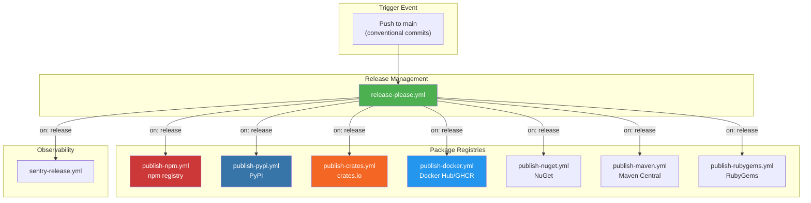

### Key Points

- **Trigger**: Push to `main` with conventional commits creates a Release PR
- **Release**: When merged, creates a GitHub Release with tag
- **Publish**: Release event triggers language-specific publish workflows
- **One-to-many**: A single release can trigger multiple publish workflows

---

## CI to Deploy Pipeline

Continuous integration flows into deployment through different stages.

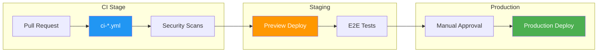

### Deployment Targets

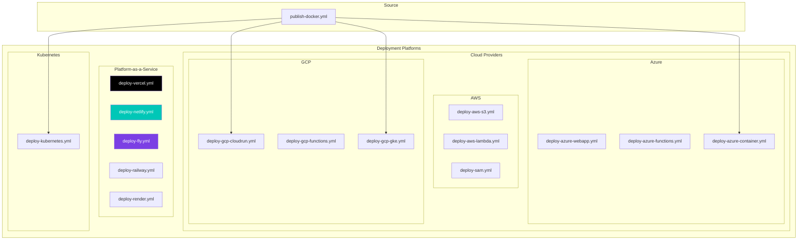

---

## Security Scanning Flow

Security workflows can run in parallel or sequence depending on configuration.

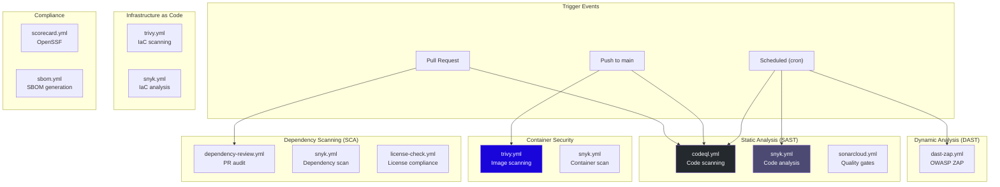

### Security Decision Tree

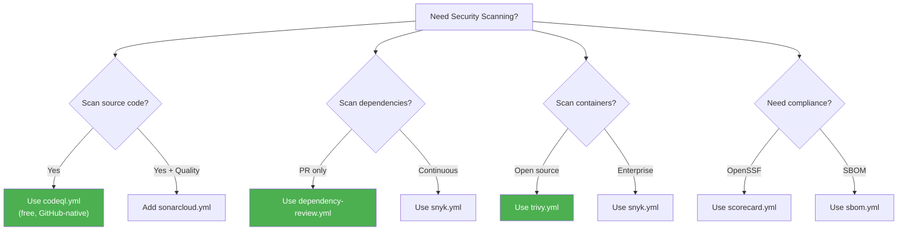

---

## Project Type Stacks

### Node.js Web Application

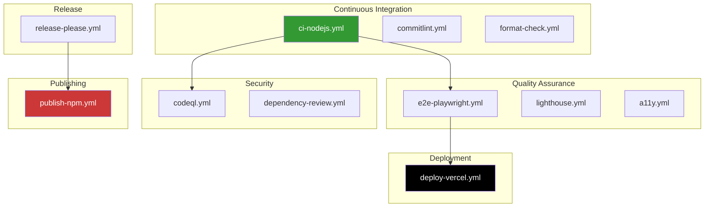

**Copy command:**
```bash
cp templates/workflows/{ci-nodejs,commitlint,e2e-playwright,codeql,dependency-review,release-please,deploy-vercel}.yml .github/workflows/
```

---

### Python Package

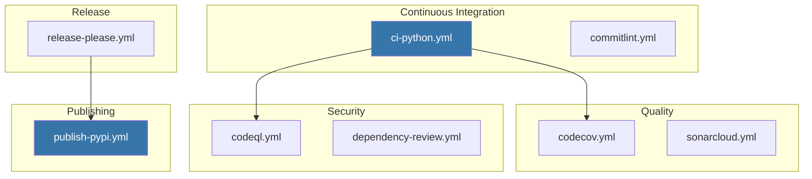

**Copy command:**
```bash
cp templates/workflows/{ci-python,commitlint,codecov,codeql,dependency-review,release-please,publish-pypi}.yml .github/workflows/
```

---

### Full-Stack Docker

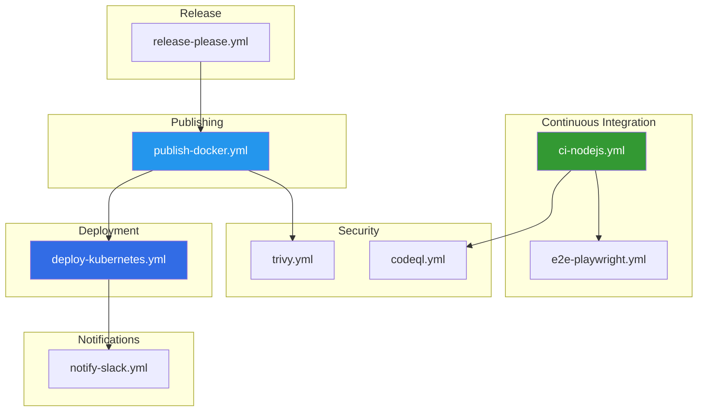

**Copy command:**
```bash
cp templates/workflows/{ci-nodejs,e2e-playwright,codeql,trivy,release-please,publish-docker,deploy-kubernetes,notify-slack}.yml .github/workflows/
```

---

### Mobile Application

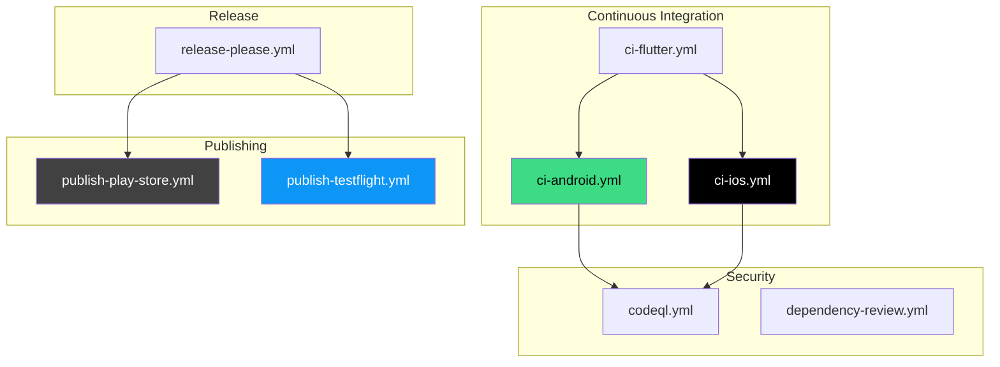

**Copy command (Flutter):**
```bash
cp templates/workflows/{ci-flutter,codeql,dependency-review,release-please,publish-play-store,publish-testflight}.yml .github/workflows/
```

---

### Enterprise Stack

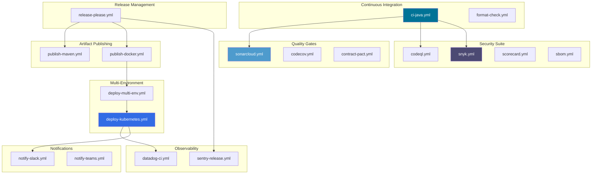

---

## Category Overview

High-level view of all workflow categories and their relationships.

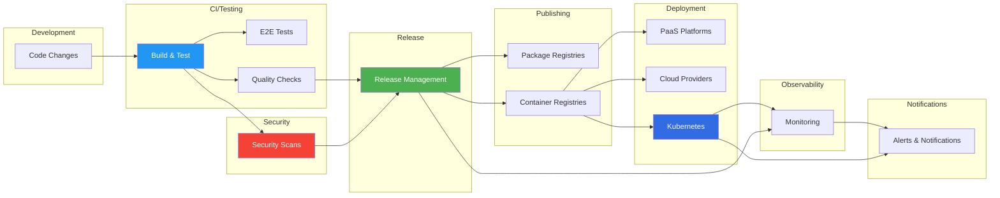

---

## Workflow Trigger Types

Understanding when workflows run based on their trigger configuration.

```mermaid
flowchart TB
    subgraph push["on: push"]
        ci["CI workflows"]
        release_please["release-please"]
        deploy_prod["Production deploys"]
    end

    subgraph pr["on: pull_request"]
        ci_pr["CI workflows"]
        deprev["dependency-review"]
        preview["Preview deploys"]
    end

    subgraph release["on: release"]
        publish["Publish workflows"]
        sentry["sentry-release"]
    end

    subgraph schedule["on: schedule"]
        security["Security scans"]
        stale["stale bot"]
        link["link-checker"]
    end

    subgraph dispatch["on: workflow_dispatch"]
        manual["Manual releases"]
        deploy_manual["Manual deploys"]
    end

    subgraph call["on: workflow_call"]
        reusable["Reusable workflows"]
        notify["Notifications"]
    end

    style push fill:#4CAF50,color:#fff
    style pr fill:#2196F3,color:#fff
    style release fill:#9C27B0,color:#fff
    style schedule fill:#FF9800,color:#fff
    style dispatch fill:#607D8B,color:#fff
    style call fill:#795548,color:#fff
```

---

## See Also

- [Workflow Metadata Index](../templates/workflows/workflow-metadata.yaml) - Structured data for all workflows
- [Compatibility Matrix](COMPATIBILITY_MATRIX.md) - Preset compatibility documentation
- [Workflow README](../templates/workflows/README.md) - Quick reference tables
- [GitHub Actions Documentation](https://docs.github.com/en/actions)
