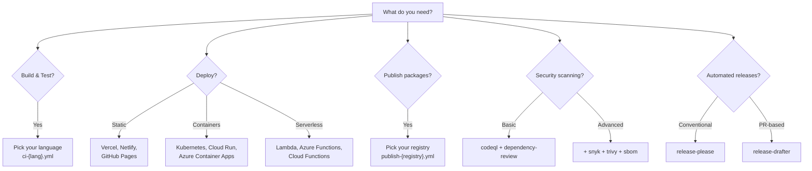
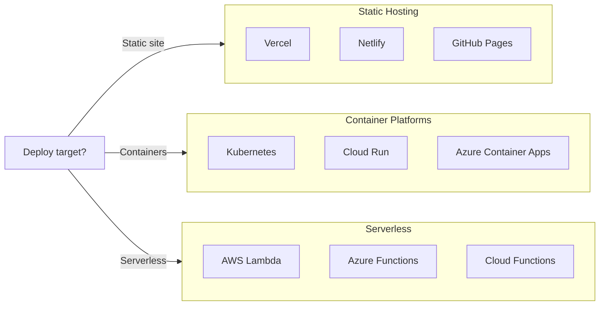
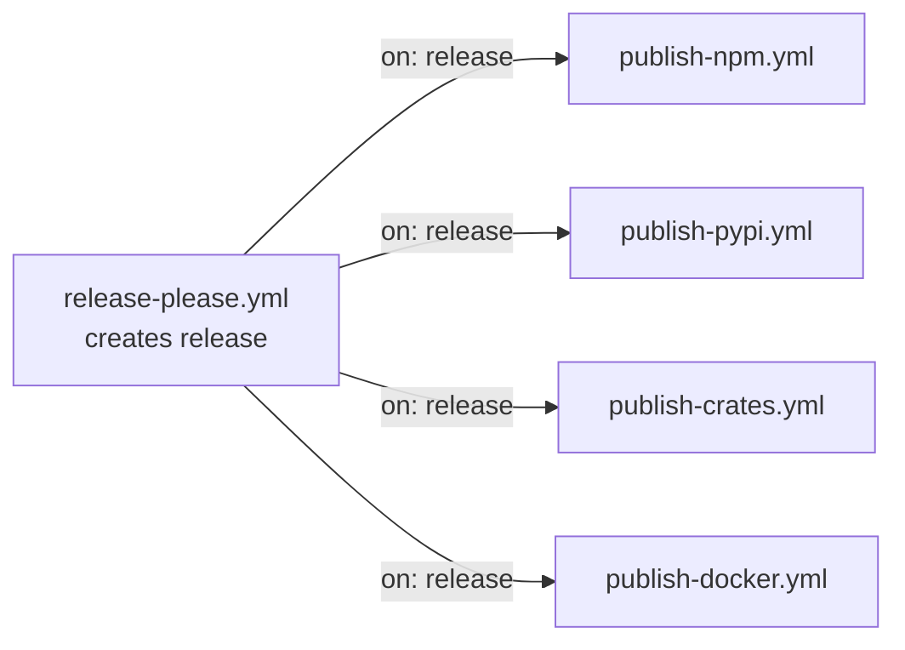

# Workflow Templates

This directory contains **113 GitHub Actions workflow templates** organized by category. Copy the workflows you need to your `.github/workflows/` directory.

## Quick Start

```bash
# Copy a single workflow
cp templates/workflows/ci-nodejs.yml .github/workflows/

# Copy multiple workflows
cp templates/workflows/{ci-nodejs,release-please,deploy-vercel}.yml .github/workflows/
```

## Quick Links

- [Workflow Diagrams](../../docs/WORKFLOW_DIAGRAMS.md) - Visual dependency graphs
- [Compatibility Matrix](../../docs/COMPATIBILITY_MATRIX.md) - Preset compatibility
- [Metadata Index](workflow-metadata.yaml) - Structured workflow data
- [/github-setup skill](../commands/github-setup.md) - Interactive setup wizard

---

## How to Choose



---

## Categories

- [CI/Testing](#citesting) - Continuous integration for various languages
- [Deployment](#deployment) - Deploy to cloud platforms and services
- [Publishing](#publishing) - Publish packages to registries
- [Security](#security) - Security scanning and analysis
- [Release Management](#release-management) - Automated releases and changelogs
- [Documentation](#documentation) - Docs, linting, and link checking
- [Community](#community) - Contributor engagement
- [Notifications](#notifications) - Alerts to Slack, Discord, etc.
- [Observability](#observability) - Monitoring and error tracking

---

## CI/Testing

Continuous integration workflows for building, testing, and validating code.

### Language-Specific CI

| Workflow | File | Language | Triggers | Complexity |
|----------|------|----------|----------|------------|
| **CI (Generic)** | `ci.yml` | Any | push, PR | Starter |
| **CI (Cross-Platform)** | `ci-cross-os.yml` | Any | push, PR | Intermediate |
| **Node.js** | `ci-nodejs.yml` | Node.js | push, PR | Starter |
| **Python** | `ci-python.yml` | Python | push, PR | Starter |
| **Go** | `ci-go.yml` | Go | push, PR | Starter |
| **Rust** | `ci-rust.yml` | Rust | push, PR | Starter |
| **Java** | `ci-java.yml` | Java | push, PR | Starter |
| **Kotlin** | `ci-kotlin.yml` | Kotlin | push, PR | Starter |
| **Scala** | `ci-scala.yml` | Scala | push, PR | Starter |
| **.NET** | `ci-dotnet.yml` | .NET | push, PR | Starter |
| **Ruby** | `ci-ruby.yml` | Ruby | push, PR | Starter |
| **PHP** | `ci-php.yml` | PHP | push, PR | Starter |
| **Elixir** | `ci-elixir.yml` | Elixir | push, PR | Starter |
| **Swift** | `ci-swift.yml` | Swift | push, PR | Starter |
| **C/C++** | `ci-cpp.yml` | C/C++ | push, PR | Intermediate |
| **Terraform** | `ci-terraform.yml` | Terraform | push, PR | Intermediate |

### Mobile & Desktop CI

| Workflow | File | Platform | Triggers | Complexity |
|----------|------|----------|----------|------------|
| **Android** | `ci-android.yml` | Android | push, PR | Intermediate |
| **iOS** | `ci-ios.yml` | iOS | push, PR | Intermediate |
| **Flutter** | `ci-flutter.yml` | Flutter | push, PR | Intermediate |
| **React Native** | `ci-react-native.yml` | React Native | push, PR | Intermediate |
| **Electron** | `ci-electron.yml` | Electron | push, PR | Intermediate |
| **Browser Extension** | `ci-browser-extension.yml` | Web | push, PR | Intermediate |

### Specialized CI

| Workflow | File | Domain | Triggers | Complexity |
|----------|------|--------|----------|------------|
| **ML/Python** | `ci-ml-python.yml` | Machine Learning | push, PR | Advanced |
| **Unity** | `ci-unity.yml` | Game Dev | push, PR | Advanced |
| **Godot** | `ci-godot.yml` | Game Dev | push, PR | Intermediate |
| **PlatformIO** | `ci-platformio.yml` | IoT/Embedded | push, PR | Intermediate |
| **Hardhat** | `ci-hardhat.yml` | Web3/Solidity | push, PR | Intermediate |
| **Foundry** | `ci-foundry.yml` | Web3/Solidity | push, PR | Intermediate |
| **With Services** | `ci-with-services.yml` | DB/Cache | push, PR | Intermediate |

### Testing & Quality

| Workflow | File | Purpose | Triggers | Secrets |
|----------|------|---------|----------|---------|
| **E2E (Cypress)** | `e2e-cypress.yml` | End-to-end tests | push, PR | `CYPRESS_RECORD_KEY`* |
| **E2E (Playwright)** | `e2e-playwright.yml` | End-to-end tests | push, PR | None |
| **Coverage** | `coverage.yml` | Code coverage | push, PR | `CODECOV_TOKEN`* |
| **Codecov** | `codecov.yml` | Codecov integration | push, PR | `CODECOV_TOKEN` |
| **Format Check** | `format-check.yml` | Code formatting | push, PR | None |
| **Bundle Size** | `bundle-size.yml` | Bundle monitoring | push, PR | None |
| **Contract Testing** | `contract-pact.yml` | Pact contracts | push, PR | `PACT_BROKER_TOKEN`* |
| **Load Testing** | `load-test-k6.yml` | k6 load tests | push, PR, dispatch | `K6_CLOUD_TOKEN`* |
| **Visual (Percy)** | `visual-regression-percy.yml` | Visual regression | push, PR | `PERCY_TOKEN` |
| **Visual (Chromatic)** | `visual-regression-chromatic.yml` | Storybook visual | push, PR | `CHROMATIC_PROJECT_TOKEN` |
| **Visual (BackstopJS)** | `visual-regression-backstop.yml` | Open-source visual | push, PR | None |

*Optional secrets

---

## Deployment

Deploy applications to cloud platforms and hosting services.

### Platform Decision Tree



### PaaS Platforms

| Workflow | File | Platform | Triggers | Required Secrets |
|----------|------|----------|----------|------------------|
| **GitHub Pages** | `deploy-github-pages.yml` | GitHub | push, dispatch | None |
| **Vercel** | `deploy-vercel.yml` | Vercel | push, PR | `VERCEL_TOKEN`, `VERCEL_ORG_ID`, `VERCEL_PROJECT_ID` |
| **Netlify** | `deploy-netlify.yml` | Netlify | push, PR | `NETLIFY_AUTH_TOKEN`, `NETLIFY_SITE_ID` |
| **Render** | `deploy-render.yml` | Render | push | `RENDER_DEPLOY_HOOK_URL` |
| **Railway** | `deploy-railway.yml` | Railway | push | `RAILWAY_TOKEN` |
| **Fly.io** | `deploy-fly.yml` | Fly.io | push | `FLY_API_TOKEN` |
| **DigitalOcean** | `deploy-digitalocean.yml` | DigitalOcean | push | `DIGITALOCEAN_ACCESS_TOKEN` |

### AWS Deployments

| Workflow | File | Service | Triggers | Required Secrets |
|----------|------|---------|----------|------------------|
| **AWS S3** | `deploy-aws-s3.yml` | S3 | push | `AWS_ACCESS_KEY_ID`, `AWS_SECRET_ACCESS_KEY` |
| **AWS Lambda** | `deploy-aws-lambda.yml` | Lambda | push | `AWS_ACCESS_KEY_ID`, `AWS_SECRET_ACCESS_KEY` |
| **AWS SAM** | `deploy-sam.yml` | SAM | push | `AWS_ACCESS_KEY_ID`, `AWS_SECRET_ACCESS_KEY` |
| **Serverless** | `deploy-serverless.yml` | Multi-cloud | push | `AWS_ACCESS_KEY_ID`, `AWS_SECRET_ACCESS_KEY` |

### Azure Deployments

| Workflow | File | Service | Triggers | Required Secrets |
|----------|------|---------|----------|------------------|
| **Azure App Service** | `deploy-azure-webapp.yml` | App Service | push | `AZURE_CREDENTIALS`, `AZURE_WEBAPP_NAME` |
| **Azure Functions** | `deploy-azure-functions.yml` | Functions | push | `AZURE_CREDENTIALS`, `AZURE_FUNCTIONAPP_NAME` |
| **Azure Containers** | `deploy-azure-container.yml` | Container Apps | push | `AZURE_CREDENTIALS` |

### GCP Deployments

| Workflow | File | Service | Triggers | Required Secrets |
|----------|------|---------|----------|------------------|
| **Cloud Run** | `deploy-gcp-cloudrun.yml` | Cloud Run | push | `GCP_CREDENTIALS`, `GCP_PROJECT_ID` |
| **Cloud Functions** | `deploy-gcp-functions.yml` | Functions | push | `GCP_CREDENTIALS`, `GCP_PROJECT_ID` |
| **GKE** | `deploy-gcp-gke.yml` | GKE | push | `GCP_CREDENTIALS`, `GKE_CLUSTER_NAME`, `GKE_CLUSTER_LOCATION` |

### Kubernetes & Infrastructure

| Workflow | File | Platform | Triggers | Required Secrets |
|----------|------|----------|----------|------------------|
| **Kubernetes** | `deploy-kubernetes.yml` | K8s | push, dispatch | `KUBE_CONFIG` |
| **Pulumi** | `deploy-pulumi.yml` | IaC | push, PR | `PULUMI_ACCESS_TOKEN` |
| **Multi-Environment** | `deploy-multi-env.yml` | Staged | push, dispatch | Varies |
| **Smart Contract** | `deploy-contract.yml` | Ethereum | push, dispatch | `DEPLOYER_PRIVATE_KEY` |

---

## Publishing

Publish packages to registries and marketplaces.

### Release to Publish Flow



### Package Registries

| Workflow | File | Registry | Trigger | Required Secrets |
|----------|------|----------|---------|------------------|
| **npm** | `publish-npm.yml` | npm | release | `NPM_TOKEN` |
| **PyPI** | `publish-pypi.yml` | PyPI | release | `PYPI_API_TOKEN` |
| **crates.io** | `publish-crates.yml` | crates.io | release | `CRATES_TOKEN` |
| **RubyGems** | `publish-rubygems.yml` | RubyGems | release | `RUBYGEMS_API_KEY` |
| **NuGet** | `publish-nuget.yml` | NuGet | release | `NUGET_API_KEY` |
| **Maven Central** | `publish-maven.yml` | Maven | release | `MAVEN_USERNAME`, `MAVEN_PASSWORD`, `GPG_*` |

### Container Registries

| Workflow | File | Registry | Trigger | Required Secrets |
|----------|------|----------|---------|------------------|
| **Docker (GHCR)** | `publish-docker.yml` | GHCR | release, push | None (uses GITHUB_TOKEN) |
| **Docker Hub** | `publish-docker-hub.yml` | Docker Hub | release, push | `DOCKER_USERNAME`, `DOCKER_PASSWORD` |
| **Amazon ECR** | `publish-docker-ecr.yml` | ECR | release, push | `AWS_ACCESS_KEY_ID`, `AWS_SECRET_ACCESS_KEY` |
| **Google GCR** | `publish-docker-gcr.yml` | GCR | release, push | `GCP_CREDENTIALS` |
| **Azure ACR** | `publish-docker-acr.yml` | ACR | release, push | `AZURE_CREDENTIALS` |

### App Stores & Marketplaces

| Workflow | File | Store | Trigger | Required Secrets |
|----------|------|-------|---------|------------------|
| **Chrome Extension** | `publish-chrome-extension.yml` | Chrome Web Store | release | `CHROME_*` (4 secrets) |
| **Firefox Add-on** | `publish-firefox-addon.yml` | Firefox Add-ons | release | `FIREFOX_JWT_ISSUER`, `FIREFOX_JWT_SECRET` |
| **Google Play** | `publish-play-store.yml` | Play Store | release | `PLAY_STORE_SERVICE_ACCOUNT_JSON`, `ANDROID_*` |
| **TestFlight** | `publish-testflight.yml` | App Store | release | `APP_STORE_CONNECT_*`, `MATCH_*` |
| **Electron** | `publish-electron.yml` | GitHub | release | `APPLE_*`*, `CSC_*`* |
| **CLI Binaries** | `publish-cli-binaries.yml` | GitHub | release | None |
| **Amazon KDP** | `amazon-kdp-publish.yml` | Kindle | release, dispatch | None |

---

## Security

Security scanning, vulnerability detection, and compliance.

### Security Stack Comparison

| Tool | SAST | SCA | Container | IaC | Cost |
|------|:----:|:---:|:---------:|:---:|------|
| **CodeQL** | ✅ | - | - | - | Free |
| **Dependency Review** | - | ✅ | - | - | Free |
| **Trivy** | - | ✅ | ✅ | ✅ | Free |
| **Snyk** | ✅ | ✅ | ✅ | ✅ | Freemium |
| **SonarCloud** | ✅ | - | - | - | Freemium |

### Security Workflows

| Workflow | File | Type | Triggers | Required Secrets |
|----------|------|------|----------|------------------|
| **CodeQL** | `codeql.yml` | SAST | push, PR, schedule | None |
| **Dependency Review** | `dependency-review.yml` | SCA | PR | None |
| **Trivy** | `trivy.yml` | Multi | push, PR, schedule | None |
| **Snyk** | `snyk.yml` | Multi | push, PR, schedule | `SNYK_TOKEN` |
| **OpenSSF Scorecard** | `scorecard.yml` | Metrics | push, schedule | None |
| **SBOM** | `sbom.yml` | Inventory | release, push | None |
| **DAST (ZAP)** | `dast-zap.yml` | DAST | push, PR, schedule | None |
| **License Check** | `license-check.yml` | Compliance | push, PR | None |
| **Secrets Rotation** | `secrets-rotation.yml` | Ops | schedule | None |

---

## Release Management

Automate versioning, changelogs, and releases.

| Workflow | File | Approach | Triggers | Secrets |
|----------|------|----------|----------|---------|
| **Release Please** | `release-please.yml` | Conventional commits | push | None |
| **Release Drafter** | `release-drafter.yml` | PR labels | push, PR | None |
| **Manual Release** | `release-manual.yml` | Manual trigger | dispatch | None |
| **Firmware Release** | `release-firmware.yml` | Embedded | release | None |

> **Note:** `release-please` and `release-drafter` are mutually exclusive. Choose one approach.

---

## Documentation

Documentation generation, linting, and validation.

| Workflow | File | Purpose | Triggers | Secrets |
|----------|------|---------|----------|---------|
| **API Docs** | `docs-api.yml` | Generate docs | push, PR | None |
| **OpenAPI Docs** | `api-docs.yml` | OpenAPI/Swagger | push, PR | None |
| **Markdown Lint** | `markdown-lint.yml` | Lint markdown | push, PR | None |
| **Spell Check** | `spell-check.yml` | Check spelling | push, PR | None |
| **Link Checker** | `link-checker.yml` | Validate URLs | push, PR, schedule | None |
| **Super-Linter** | `super-linter.yml` | Multi-language | push, PR | None |
| **Commitlint** | `commitlint.yml` | Commit messages | push, PR | None |
| **Lighthouse** | `lighthouse.yml` | Performance | push, PR | `LHCI_GITHUB_APP_TOKEN`* |
| **Accessibility** | `a11y.yml` | a11y testing | push, PR | None |
| **Storybook** | `storybook-publish.yml` | Publish Storybook | push | None |

---

## Community

Contributor engagement and issue management.

| Workflow | File | Purpose | Triggers | Secrets |
|----------|------|---------|----------|---------|
| **Welcome** | `welcome.yml` | Greet contributors | issues, PR | None |
| **Stale** | `stale.yml` | Mark inactive | schedule | None |
| **All Contributors** | `all-contributors.yml` | Recognize contributors | issue_comment | None |
| **Auto Labeler** | `auto-labeler.yml` | Label PRs | PR | None |
| **Artifact Preview** | `artifact-preview.yml` | PR previews | PR | None |

---

## Notifications

Send alerts to external services.

| Workflow | File | Platform | Triggers | Required Secrets |
|----------|------|----------|----------|------------------|
| **Slack** | `notify-slack.yml` | Slack | call, push | `SLACK_WEBHOOK_URL` |
| **Discord** | `notify-discord.yml` | Discord | call, push | `DISCORD_WEBHOOK_URL` |
| **Teams** | `notify-teams.yml` | MS Teams | call, push | `TEAMS_WEBHOOK_URL` |

---

## Observability

Monitoring, error tracking, and CI analytics.

| Workflow | File | Platform | Triggers | Required Secrets |
|----------|------|----------|----------|------------------|
| **Datadog CI** | `datadog-ci.yml` | Datadog | push, PR | `DD_API_KEY` |
| **Sentry Release** | `sentry-release.yml` | Sentry | release, push | `SENTRY_AUTH_TOKEN`, `SENTRY_ORG`, `SENTRY_PROJECT` |
| **SonarCloud** | `sonarcloud.yml` | SonarCloud | push, PR | `SONAR_TOKEN` |

---

## Usage Tips

### Combining Workflows

Most projects need a combination of workflows. Common stacks:

**Node.js Web App:**
```bash
cp templates/workflows/{ci-nodejs,release-please,deploy-vercel,dependency-review}.yml .github/workflows/
```

**Python Package:**
```bash
cp templates/workflows/{ci-python,publish-pypi,release-please,codeql}.yml .github/workflows/
```

**Full-Stack with Docker:**
```bash
cp templates/workflows/{ci-nodejs,e2e-playwright,publish-docker,deploy-kubernetes}.yml .github/workflows/
```

### Customization

Each workflow includes comments explaining configuration options. Key things to customize:

1. **Triggers** - Adjust `on:` to match your branching strategy
2. **Versions** - Update language/tool versions for your project
3. **Secrets** - Add required secrets in repository settings
4. **Environments** - Configure deployment environments if needed

---

## Consolidated Secrets Reference

### Publishing

| Secret | Used By | Setup |
|--------|---------|-------|
| `NPM_TOKEN` | publish-npm | [npm tokens](https://www.npmjs.com/settings/~/tokens) |
| `PYPI_API_TOKEN` | publish-pypi | [PyPI tokens](https://pypi.org/manage/account/) |
| `CRATES_TOKEN` | publish-crates | [crates.io tokens](https://crates.io/settings/tokens) |
| `DOCKER_USERNAME` | publish-docker-hub | [Docker Hub](https://hub.docker.com/settings/security) |
| `DOCKER_PASSWORD` | publish-docker-hub | Docker Hub access token |

### Deployment

| Secret | Used By | Setup |
|--------|---------|-------|
| `VERCEL_TOKEN` | deploy-vercel | [Vercel tokens](https://vercel.com/account/tokens) |
| `NETLIFY_AUTH_TOKEN` | deploy-netlify | [Netlify tokens](https://app.netlify.com/user/applications) |
| `FLY_API_TOKEN` | deploy-fly | [Fly.io tokens](https://fly.io/docs/reference/private-networking/#app-token) |
| `AWS_ACCESS_KEY_ID` | deploy-aws-* | AWS IAM |
| `AWS_SECRET_ACCESS_KEY` | deploy-aws-* | AWS IAM |
| `AZURE_CREDENTIALS` | deploy-azure-* | Azure Service Principal |
| `GCP_CREDENTIALS` | deploy-gcp-* | GCP Service Account |
| `KUBE_CONFIG` | deploy-kubernetes | Base64-encoded kubeconfig |

### Security & Quality

| Secret | Used By | Setup |
|--------|---------|-------|
| `SNYK_TOKEN` | snyk | [Snyk account](https://app.snyk.io/account) |
| `SONAR_TOKEN` | sonarcloud | [SonarCloud security](https://sonarcloud.io/account/security) |
| `CODECOV_TOKEN` | codecov | [Codecov](https://codecov.io) |

### Notifications

| Secret | Used By | Setup |
|--------|---------|-------|
| `SLACK_WEBHOOK_URL` | notify-slack | [Slack webhooks](https://api.slack.com/messaging/webhooks) |
| `DISCORD_WEBHOOK_URL` | notify-discord | Discord server settings |
| `TEAMS_WEBHOOK_URL` | notify-teams | Teams connector |

### Observability

| Secret | Used By | Setup |
|--------|---------|-------|
| `DD_API_KEY` | datadog-ci | [Datadog API keys](https://app.datadoghq.com/organization-settings/api-keys) |
| `SENTRY_AUTH_TOKEN` | sentry-release | [Sentry tokens](https://sentry.io/settings/account/api/auth-tokens/) |

---

## See Also

- [Workflow Diagrams](../../docs/WORKFLOW_DIAGRAMS.md) - Visual dependency graphs
- [Compatibility Matrix](../../docs/COMPATIBILITY_MATRIX.md) - Preset compatibility
- [Metadata Index](workflow-metadata.yaml) - Structured workflow data
- [GitHub Actions Documentation](https://docs.github.com/en/actions)
- [Workflow Syntax Reference](https://docs.github.com/en/actions/reference/workflow-syntax-for-github-actions)
- [/github-setup skill](../commands/github-setup.md) - Interactive setup wizard
